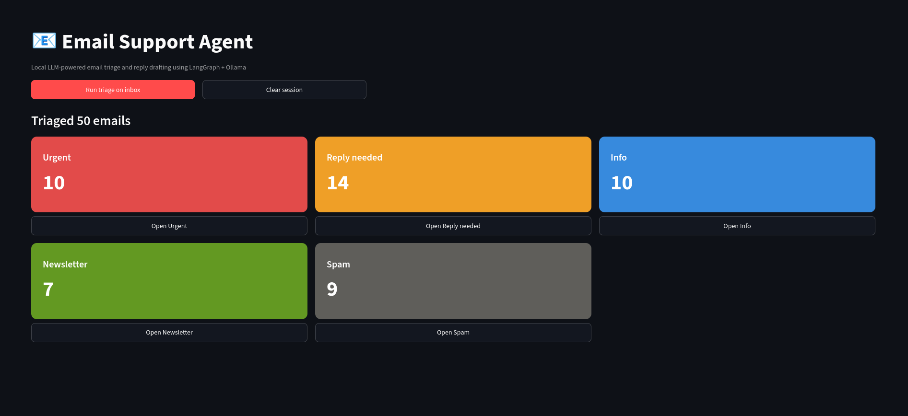
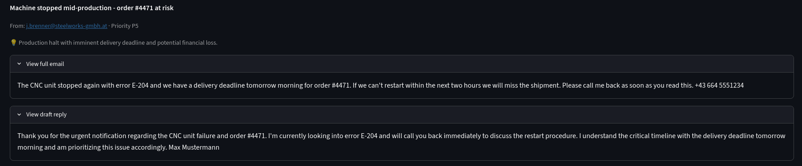

# Email Support Agent

A local, privacy-first email triage agent built with **LangGraph** and **Ollama**.
It classifies incoming emails, assigns a priority score with reasoning, and drafts
reply suggestions for everything that needs a response — orders, support requests,
complaints, quotes, internal mail. No data ever leaves your machine.

## What it does

Every email runs through a LangGraph pipeline:

```
              ┌────────────┐     ┌─────────────┐
  email ────▶ │  classify  │ ──▶ │ prioritize  │ ──┐
              └────────────┘     └─────────────┘   │ router
                                                   ▼
                                    urgent / reply_needed ──▶ draft reply
                                    everything else       ──▶ archive
```

1. **Classify** — one of five *action-oriented* categories:
   `urgent`, `reply_needed`, `info`, `newsletter`, `spam`.
   Categories describe what to *do* with an email, not what it is about —
   so an order inquiry, a refund request and a project question all land
   correctly without any domain-specific configuration.
2. **Prioritize** — score 1–5 with a one-sentence reason, validated with Pydantic.
3. **Route** — actionable emails go to the drafter, the rest is archived.
4. **Draft** — a short, professional reply suggestion, signed with your name.

Results are shown in a **Streamlit dashboard** with color-coded category tiles,
per-category views sorted by priority, and expandable original/draft views.






## Production hardening

- **Hard timeout on every LLM request** (configurable, default 120s)
- **Retry with exponential backoff** on transient connection errors only (tenacity)
- **Graceful degradation** — invalid LLM output falls back to safe defaults
  (`info` / P2), flagged in the UI and logs; one bad email never aborts a batch run
- **Pydantic validation** of all structured LLM output
- **Structured logging** with a per-run ID, console + rotating file sink (loguru)
- **All configuration via `.env`** — model, Ollama URL, timeouts, log level

## Setup

Requires Python 3.12+ and a running [Ollama](https://ollama.com) instance.

```bash
git clone <repo-url> && cd email_support_agent
python -m venv venv && source venv/bin/activate
pip install -r requirements.txt
cp .env.example .env
streamlit run app.py
```

Pull the default model first if you don't have it: `ollama pull qwen2.5:14b`.
Any Ollama chat model works — set `OLLAMA_MODEL` in `.env`.

There is also a CLI runner without UI: `python main.py`

## Demo data

`data/mock_emails.json` contains **50 realistic mock emails**: customer orders,
returns, invoice disputes, delivery inquiries, complaints, internal mail,
newsletters and spam — including deliberate edge cases (empty body, missing
subject, HTML remnants, quoted reply chains, mixed languages, ambiguous cases)
to demonstrate robust handling.

## Project structure

```
email_support_agent/
├── app.py                  # Streamlit dashboard
├── main.py                 # CLI runner
├── config.py               # Settings + logging setup (.env driven)
├── agent/
│   ├── state.py            # Pydantic Email model + graph state
│   ├── graph.py            # LangGraph pipeline definition
│   └── nodes/
│       ├── classifier.py
│       ├── prioritizer.py
│       ├── router.py
│       └── drafter.py
├── utils/
│   ├── llm.py              # Shared LLM factory: timeout + retry
│   └── mock_loader.py
└── data/mock_emails.json   # 50-email demo inbox
```

## Roadmap / possible extensions

- **Live inbox connection** via Gmail IMAP / Microsoft Graph instead of mock data
- **Attachment processing with OCR** — extract data from PDF invoices and order documents
- **One-click send** of approved drafts via SMTP
- **Docker delivery** with docker-compose for non-technical deployments


## License

MIT